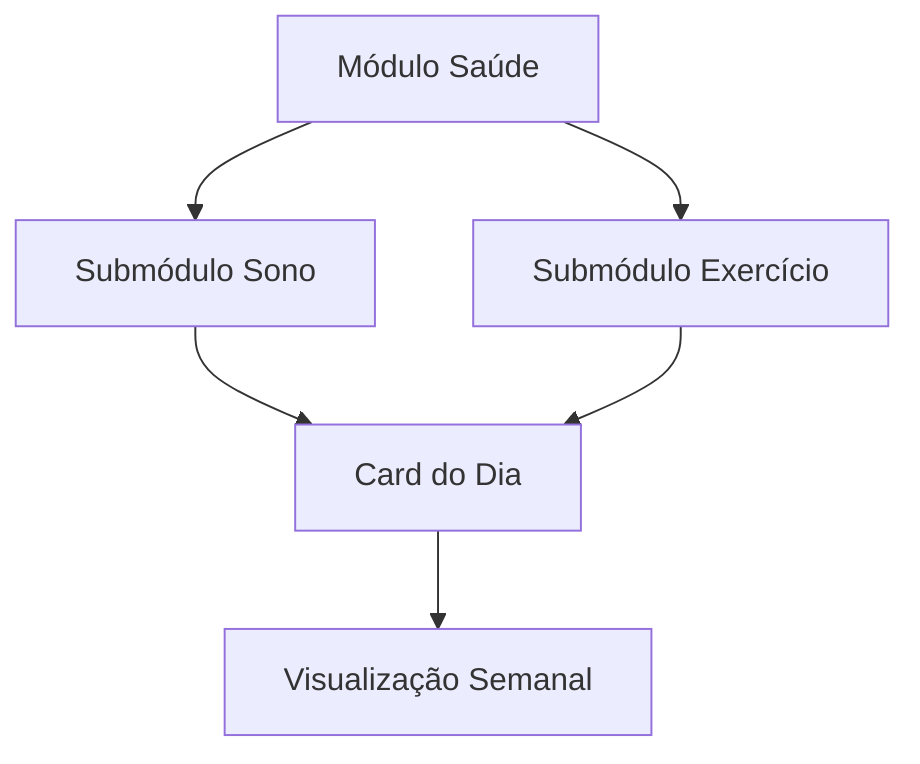

# SKILLS — Habilidades do Agente de Documentação

> Este documento lista as skills, ferramentas e técnicas que o Agente de Documentação deve dominar e saber quando ativar. Skills estão organizadas por categoria de tarefa.

---

## 1. Skills de documentação

### 1.1 Geração de ADRs

**Skill**: `documentation-generation-architecture-decision-records`

Ativar quando:

- Uma decisão arquitetural for tomada durante uma sessão com qualquer agente.
- Uma tecnologia, biblioteca ou padrão for escolhido em detrimento de alternativas.
- Uma mudança no modelo de dados for proposta.
- Um contrato público (card, interface, evento) for alterado.

Como usar:

1. Identificar a decisão e seu contexto.
2. Estruturar o ADR: título, status, contexto, decisão, consequências, alternativas.
3. Numerar sequencialmente: `0001-nome-do-adr.md`.
4. Salvar em `.context/decisions/`.
5. Atualizar o índice de ADRs se existir.

### 1.2 Automação de changelog

**Skill**: `documentation-generation-changelog-automation`

Ativar quando:

- Um release for preparado ou publicado.
- Mudanças forem mergeadas na branch principal.
- For necessário revisar mensagens de commit para gerar entradas de changelog.

Como usar:

1. Revisar commits desde o último release.
2. Categorizar mudanças por tipo (Added, Changed, Deprecated, Removed, Fixed, Security).
3. Escrever entradas em português, no pretérito perfeito ou presente.
4. Referenciar PRs, commits ou issues relevantes.
5. Manter a seção `[Unreleased]` sempre atualizada.

Formato de cada entrada:

```markdown
### Added

- Documentação de API para o módulo de saúde (#42)
- Guia de contribuição inicial (PR #58)

### Fixed

- Link quebrado no README do submódulo de sono (commit abc123)
```

### 1.3 Geração de spec OpenAPI

**Skill**: `documentation-generation-openapi-spec-generation`

Ativar quando:

- Uma nova API HTTP for criada.
- Uma API existente sofrer mudança de contrato.
- For necessário validar a consistência entre implementação e documentação.

Como usar:

1. Extrair endpoints, métodos, parâmetros, headers e corpos.
2. Gerar spec OpenAPI 3.x em YAML ou JSON.
3. Salvar em `docs/api/` ou conforme estrutura definida.
4. Validar a spec contra a implementação sempre que possível.

### 1.4 Padrão HADS

**Skill**: `documentation-standards-hads`

Ativar quando:

- Um novo documento de especificação for criado.
- For necessário garantir consistência entre documentos do projeto.

HADS (Hypertext Application Documentation Standard) é o formato preferido para documentação técnica no nexus. Quando aplicável, estruturar documentos seguindo:

1. **Identidade**: título, propósito, público-alvo.
2. **Contexto**: problema resolvido, decisões relacionadas.
3. **Corpo**: especificação detalhada, exemplos, diagramas.
4. **Referências**: links para documentos relacionados, ADRs, código-fonte.
5. **Metadados**: autor, data, versão, status.

---

## 2. Skills de documentação de código

### 2.1 Docs Architect

**Skill ativada via agente**: `code-documentation__docs-architect`

Responsável por projetar a estrutura geral da documentação técnica. Ativar quando:

- For necessário criar uma nova seção de documentação técnica.
- A estrutura atual da documentação precisar ser reorganizada.
- Novos módulos ou submódulos forem adicionados e precisarem de cobertura documental.

### 2.2 Tutorial Engineer

**Skill ativada via agente**: `code-documentation__tutorial-engineer`

Responsável por criar guias passo a passo e tutoriais. Ativar quando:

- Um novo contribuidor precisar de orientação de setup.
- Uma feature complexa precisar de um walkthrough.
- For necessário criar material de onboarding.

### 2.3 Code Reviewer (documentação)

**Skill ativada via agente**: `code-documentation` (contexto de revisão)

Ativar quando:

- Um PR contiver mudanças de documentação.
- For necessário verificar se doc comments estão presentes e corretos.
- A documentação gerada automaticamente precisar de revisão humana.

---

## 3. Skills especializadas de documentação

### 3.1 API Documenter

**Agente relacionado**: `documentation-generation__api-documenter`

Focado exclusivamente em documentação de APIs. Ativar quando:

- Uma nova API for implementada.
- Uma API existente mudar de versão.
- For necessário gerar exemplos de requisição e resposta.

### 3.2 Mermaid Expert

**Agente relacionado**: `documentation-generation__mermaid-expert`

Especialista em diagramas Mermaid. Ativar quando:

- Um diagrama de arquitetura precisar ser criado ou atualizado.
- Um fluxo de dados precisar ser visualizado.
- Uma relação entre módulos precisar ser representada graficamente.

Tipos de diagrama mais usados no nexus:



### 3.3 Reference Builder

**Agente relacionado**: `documentation-generation__reference-builder`

Responsável por documentação de referência (glossários, índices, tabelas de compatibilidade). Ativar quando:

- Um glossário precisar ser atualizado.
- Uma tabela de referência técnica for necessária.
- Um índice de documentos precisar ser mantido.

---

## 4. Como ativar skills no fluxo de trabalho

### Diagrama de ativação

```
Nova tarefa de documentação
│
├── Decisão arquitetural? → ADR skill
├── Release sendo preparado? → Changelog skill
├── Nova API HTTP? → OpenAPI skill
├── Novo documento formal? → HADS skill
├── Precisa de tutorial? → Tutorial Engineer
├── Precisa de diagrama? → Mermaid Expert
├── Precisa de referência? → Reference Builder
└── Precisa estruturar docs? → Docs Architect
```

### Sequência recomendada para documentar uma nova feature

1. **Docs Architect**: definir onde a documentação se encaixa na estrutura existente.
2. **ADR skill**: registrar decisões arquiteturais relacionadas à feature.
3. **OpenAPI skill** (se aplicável): documentar novas APIs.
4. **Mermaid Expert**: criar diagramas de fluxo e arquitetura.
5. **Tutorial Engineer** (se aplicável): criar walkthrough de uso.
6. **Reference Builder**: atualizar glossário e índices.
7. **Changelog skill**: registrar a feature como adicionada.

---

## 5. Skills complementares

- **Leitura de código**: entender o código para documentar com precisão.
- **Git diff analysis**: extrair mudanças relevantes entre versões.
- **Markdown avançado**: tabelas, listas aninhadas, footnotes, alerts, code blocks com sintaxe highlight.
- **Revisão técnica**: validar se a documentação corresponde ao comportamento real do sistema.
- **Search e grep**: localizar documentação existente para evitar duplicação.
